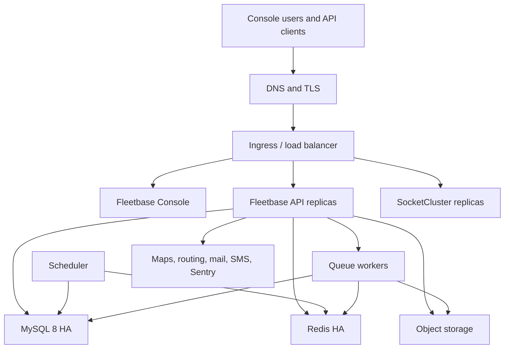

# Infrastructure Sizing

This guide gives infrastructure teams a practical baseline for planning self-hosted, private cloud, or on-premise Fleetbase deployments. Treat these numbers as planning guidance, not a fixed benchmark. Final sizing depends on active vehicles and devices, active drivers, order volume, telemetry frequency, concurrent users, custom extensions, uploaded media, integration traffic, and retention policy.

Fleetbase does not require GPU resources for the core platform. GPU capacity is only relevant if you run separate AI, computer vision, route optimization, or analytics workloads outside the standard Fleetbase application stack.

## Reference Stack

Fleetbase production deployments are built from these core services:

| Component | Purpose | Production notes |
| :--- | :--- | :--- |
| Fleetbase API | Laravel/Octane backend, REST API, internal APIs, webhooks, reports, and extension server packages | Run as horizontally scalable containers behind an ingress or load balancer |
| Fleetbase Console | Ember.js web console and extension engines | Serve as static assets through the console container, CDN, or reverse proxy |
| MySQL 8 | Primary transactional database | Use managed MySQL or an HA MySQL cluster with automated backups and point-in-time recovery |
| Redis | Cache, sessions, and queue backend | Use managed Redis or a Redis HA deployment with persistence where supported |
| Queue workers | Async processing for webhooks, imports, reports, notifications, and scheduled work | Scale independently from API replicas based on queue depth and job latency |
| Scheduler | Laravel scheduled tasks and maintenance jobs | Run one active scheduler per environment |
| SocketCluster | WebSocket server for live maps, status updates, chat, and real-time console events | Expose through WebSocket-aware ingress with restricted origins |
| Object storage | Documents, media, proof of delivery, imports, exports, and backups | Use S3-compatible storage, GCS, Azure Blob via S3 gateway, MinIO, or equivalent |
| External services | Maps, geocoding, routing, SMS, email, push notifications, error monitoring | Allow only the outbound endpoints required by the enabled features |

The default Docker Compose stack is suitable for development, testing, evaluation, and small self-hosted deployments. For enterprise production, use Kubernetes or an equivalent orchestrator so the API, queue workers, WebSocket tier, and backing services can be scaled and upgraded independently.

## Environment Tiers

| Environment | Baseline purpose | Minimum sizing | Recommended sizing |
| :--- | :--- | :--- | :--- |
| Development | Local developer testing and extension work | 4 CPU cores, 8 GB RAM, 40 GB SSD on a workstation or VM | 6-8 CPU cores, 16 GB RAM, 80 GB SSD |
| Testing | QA, automated tests, demo data, integration validation | 2 vCPU, 4 GB RAM, 60 GB SSD | 4 vCPU, 8 GB RAM, 100 GB SSD |
| Staging | Production-like release validation and customer UAT | 4 vCPU, 8 GB RAM, 150 GB SSD plus external MySQL/Redis/object storage | 2 API replicas, external MySQL/Redis, 250 GB storage, production-like DNS/TLS |
| Minimum production | Small production or pilot deployment | 1 Docker host with 4 vCPU, 16 GB RAM, 200 GB SSD, external backups | 2 application hosts or small Kubernetes cluster, managed MySQL/Redis, object storage |
| Enterprise production | HA deployment for large fleets and regulated operations | Kubernetes HA baseline with external MySQL, Redis, object storage, logging, monitoring, backups | Kubernetes HA sized for workload, multi-AZ backing services, tested DR runbooks |

For production, avoid running database, Redis, application containers, file storage, and backups all on the same VM unless the deployment is a limited pilot with accepted downtime risk.

## Sizing Drivers

Fleetbase deployments should be sized from workload shape, not a single headline metric. Vehicle count matters, but it is only one input. A fleet with modest telemetry and low order throughput can need less infrastructure than a smaller operation with dense telemetry, heavy imports, many dispatchers, or long retention requirements.

| Driver | Why it matters | Planning input to collect |
| :--- | :--- | :--- |
| Active vehicles and devices | Drives telemetry/event ingest, live map activity, and device-history storage | Registered vehicles, active vehicles per shift, devices per vehicle, provider payload size |
| Active drivers | Drives mobile/API sessions, location updates, notifications, and dispatch activity | Concurrent drivers, shift patterns, Navigator app usage, notification volume |
| Orders per day | Drives API writes, workflow activity, route data, proof records, and customer-facing updates | Average and peak daily orders, status-change frequency, proof-of-delivery requirements |
| Telemetry interval and payload size | Drives the highest-volume time-series style workload in many deployments | Update interval, average payload size, burst behavior, raw-history retention |
| Concurrent console/API users | Drives API concurrency, query load, real-time subscriptions, and browser sessions | Dispatchers, admins, support users, customer portal users, API clients |
| Webhook and integration traffic | Drives queue throughput, retries, outbound HTTP load, and logs | Webhook endpoints, retry policy, third-party SLAs, integration batch sizes |
| Uploaded media and documents | Drives object storage, CDN needs, malware scanning, backup size, and lifecycle rules | Proof photos, driver documents, imports, exports, attachments, average file size |
| Retention and backup policy | Drives database size, object storage, log storage, backup storage, and restore time | Hot retention, archive retention, RTO, RPO, compliance requirements |

Use these workload profiles as a starting point, then adjust each tier using the formulas below.

| Profile | Typical shape | Infrastructure posture |
| :--- | :--- | :--- |
| Pilot / small production | Limited users, moderate order volume, low-to-moderate telemetry, short retention | Docker Compose or small Kubernetes deployment with managed MySQL/Redis preferred |
| Growing production | Multiple teams, daily operational use, integrations, regular imports/exports, expanding telemetry | Kubernetes or equivalent orchestration, separate workers, external MySQL/Redis, object storage |
| Large / enterprise production | High concurrent usage, dense telemetry, high order throughput, strict SLAs, long retention, many integrations | HA Kubernetes, horizontally scaled API/workers/WebSockets, HA database/cache, observability, DR runbooks |

## Recommended Kubernetes Architecture

Use Kubernetes for production environments that require high availability, rolling upgrades, operational isolation, and clear scaling paths.



Recommended production characteristics:

- Use at least three Kubernetes worker nodes or a managed Kubernetes control plane with three or more workers.
- Run two or more API replicas and scale horizontally based on CPU, memory, request latency, and queue pressure.
- Run queue workers separately from API replicas so imports, webhooks, reports, notifications, and long-running jobs do not consume request capacity.
- Run one scheduler replica with leader-election or operational controls that prevent duplicate scheduled tasks.
- Run SocketCluster behind a WebSocket-aware ingress. If multiple replicas are used, validate sticky routing and event fanout behavior for your load balancer.
- Keep MySQL, Redis, and object storage outside ephemeral application pods.
- Use private subnets for database, Redis, and internal services; expose only HTTPS and approved WebSocket endpoints publicly.

## Bill of Quantities

### Minimum Production

Use this for pilots, small fleets, and self-managed production where short maintenance windows are acceptable.

| Item | Quantity | Recommended spec |
| :--- | :--- | :--- |
| Application host or worker node | 1-2 | 4-8 vCPU, 16-32 GB RAM, 200+ GB SSD |
| Fleetbase API | 1-2 replicas | 1-2 vCPU and 2-4 GB RAM per replica |
| Queue worker | 1 replica | 1 vCPU and 1-2 GB RAM |
| Scheduler | 1 replica | 0.5-1 vCPU and 512 MB-1 GB RAM |
| SocketCluster | 1 replica | 1 vCPU and 1-2 GB RAM |
| MySQL 8 | 1 primary | 4 vCPU, 16 GB RAM, 200+ GB SSD with automated backups |
| Redis | 1 instance | 1-2 vCPU, 2-4 GB RAM |
| Object storage | 1 bucket or volume | 100 GB initial allocation, lifecycle policy enabled |
| Load balancer / reverse proxy | 1 | HTTPS termination, WebSocket support |
| Backup storage | 1 target | 30+ days database backup retention plus file backup policy |

### Large Production Reference

Use this as a starting point for high-volume operations with many active vehicles/devices, drivers, orders, integrations, real-time users, and longer retention requirements. Increase or decrease each component based on the actual sizing drivers above.

| Item | Quantity | Recommended spec |
| :--- | :--- | :--- |
| Kubernetes worker nodes | 3-5 | 8-16 vCPU, 32-64 GB RAM per node, autoscaling enabled where available |
| Fleetbase API | 3-6 replicas | 2 vCPU and 4-8 GB RAM per replica |
| Fleetbase Console | 2 replicas or static hosting | 0.5-1 vCPU and 512 MB-1 GB RAM per replica |
| Queue workers | 3-8 replicas | 1-2 vCPU and 2-4 GB RAM per replica |
| Scheduler | 1 active replica | 1 vCPU and 1 GB RAM |
| SocketCluster | 2-4 replicas | 2 vCPU and 4 GB RAM per replica, sticky/WebSocket routing validated |
| MySQL 8 HA | 1 primary plus 1-2 replicas | 16-32 vCPU, 64-128 GB RAM, 2-6 TB provisioned SSD to start |
| Redis HA | 3 nodes or managed HA tier | 4-8 vCPU total, 16-32 GB RAM total |
| Object storage | 1 replicated bucket | 1-3 TB initial allocation for files, exports, proof media, and backups |
| Observability stack | 1 production deployment | Metrics, logs, traces/errors, dashboards, alerting, and long-term retention |
| Backup storage | 1 isolated target | Database PITR, daily snapshots, object-storage versioning, restore-tested |
| Load balancer / ingress | 2+ zones or managed service | HTTPS, WebSocket upgrade support, health checks, WAF optional |
| Private registry | 1 | Fleetbase images and any customer-specific extension images |

## Sizing Formulas

Use these formulas to refine the bill of quantities once the customer provides usage data.

### Telemetry and device events

```
events_per_day = active_vehicles * (86400 / telemetry_interval_seconds)
raw_storage_per_day = events_per_day * average_event_size_bytes
database_storage = raw_storage_per_day * retention_days * index_and_overhead_factor
```

For planning, use an index and overhead factor of `2.5` to `4.0` for JSON payloads, spatial indexes, secondary indexes, row metadata, and soft-delete overhead.

Illustrative telemetry examples:

| Active vehicles/devices | Telemetry interval | Events per day | Events per year |
| :--- | :--- | :--- | :--- |
| 250 | 60 seconds | 360,000 | 131.4 million |
| 1,000 | 30 seconds | 2.88 million | 1.05 billion |
| 5,000 | 30 seconds | 14.4 million | 5.26 billion |
| 10,000 | 15 seconds | 57.6 million | 21.02 billion |

Storage sensitivity: every extra 500 bytes per stored event adds about 183 GB/year per 1 million events/day before index overhead. Apply the index and overhead factor above to estimate database allocation.

If full-fidelity telemetry must be retained for 12 months, consider partitioning, archival tables, or moving raw telemetry history to purpose-built analytics storage while keeping recent operational state in MySQL.

### Orders and workflow data

```
order_storage = orders_per_day * average_order_record_size * retention_days * overhead_factor
```

Order data usually grows more slowly than telemetry, but custom fields, activity logs, route data, proof records, and integration payloads can increase per-order storage significantly.

### Files, documents, and media

```
file_storage = uploads_per_day * average_file_size * retention_days
backup_storage = file_storage * versioning_or_backup_multiplier
```

Proof of delivery photos, driver documents, import files, exports, invoice PDFs, and attachments should live in object storage, not local container storage. Use lifecycle rules for archive and deletion.

### Logs and backups

```
log_storage = daily_log_volume * log_retention_days
backup_storage = database_size * backup_retention_factor + object_storage_backup_delta
```

Production deployments should retain application logs centrally, store database backups separately from the database cluster, and periodically test restore procedures.

## Network Requirements

| Flow | Protocol / port | Notes |
| :--- | :--- | :--- |
| Users to Console/API | HTTPS 443 | Public or private ingress, TLS required |
| Browser to SocketCluster | WSS 443 | WebSocket upgrade support required |
| Admin SSH / bastion | SSH 22 or corporate standard | Restrict by VPN, bastion, or privileged access workflow |
| API to MySQL | TCP 3306 | Private network only |
| API / workers to Redis | TCP 6379 | Private network only |
| API / workers to object storage | HTTPS 443 | S3-compatible or cloud provider endpoint |
| API / workers to mail/SMS/maps/routing | HTTPS 443 | Required only for enabled integrations |
| Monitoring agents to observability backend | HTTPS or vendor-specific | Follow your monitoring platform's requirements |

Production DNS should provide separate hostnames for the console and API, or one hostname with explicit routing paths. Certificates may come from a public CA, corporate CA, or private PKI depending on network exposure and client policy.

## Storage, Retention, and Backups

| Data class | Default location | Recommendation |
| :--- | :--- | :--- |
| Operational data | MySQL | HA MySQL, automated backups, point-in-time recovery, regular restore tests |
| Cache and queues | Redis | HA Redis for production, memory alarms, eviction policy reviewed |
| Uploads and documents | Object storage | S3-compatible bucket, encryption, lifecycle rules, versioning where required |
| Telemetry history | MySQL by default | Define retention before launch; archive high-volume history if 12+ months are required |
| Application logs | Container logs and central log backend | Centralize logs with 30-90 days hot retention, longer archive if required |
| Database backups | Backup bucket or managed backup service | Daily snapshots plus PITR for production; isolate backup credentials |

Suggested production targets:

| Target | Recommended baseline |
| :--- | :--- |
| RPO | 15 minutes to 1 hour for enterprise production, depending on MySQL backup/PITR capability |
| RTO | 4 hours for standard HA production; shorter targets require warm standby and rehearsed failover |
| Backup retention | 30 days minimum, longer for regulated environments |
| Restore tests | At least quarterly and before major upgrades |

## Security and Operations

Production environments should include:

- TLS everywhere for browser, API, and WebSocket traffic.
- Private networking for MySQL, Redis, object storage endpoints, and internal service traffic.
- Kubernetes secrets, sealed secrets, cloud secret manager, Vault, or equivalent for credentials.
- Per-environment credentials and key rotation for database users, object storage, mail, SMS, maps, and registry access.
- RBAC for Kubernetes, cloud accounts, Fleetbase users, and extension administration.
- SSO or corporate identity integration where required by the customer security model.
- Encryption at rest for database volumes, object storage, backups, and log archives.
- Vulnerability scanning for container images, host packages, dependencies, and customer-specific extensions.
- Antivirus or malware scanning for uploaded files if required by policy.
- WAF, rate limiting, IP allowlists, or VPN/private access for admin-only deployments.

Monitor and alert on:

- API request latency, error rate, memory, CPU, and replica health.
- Queue depth, job failure rate, and oldest pending job age.
- Scheduler health and missed scheduled tasks.
- SocketCluster connection count, publish failures, and rejected origins.
- MySQL CPU, memory, storage, replication lag, slow queries, lock waits, and connection usage.
- Redis memory, evictions, connection usage, and command latency.
- Object storage errors, backup completion, backup age, and restore test status.
- Certificate expiration, DNS health, ingress errors, and external integration failures.

## Commercial and Licensing References

Infrastructure sizing is separate from commercial licensing. For current commercial terms, use the website pages as the source of truth:

| Topic | Reference |
| :--- | :--- |
| Self-hosted implementation and support pricing | [Pricing](/pricing) |
| Managed installation service | [Installation Service](/services/installation) |
| AGPL and commercial license overview | [Licensing](/docs/community/licensing) |
| Proprietary, SaaS, OEM, and white-label licensing | [Commercial License](/licensing/commercial) |
| Support plans and SLA language | [Support Plans](/docs/community/support-plans) |
| Formal service terms | [Terms of Service](/terms) |

Use the AGPL-3.0 license for open-source self-hosting unless the deployment requires proprietary modifications, SaaS distribution without releasing modifications, OEM/white-label rights, or commercial license terms negotiated with Fleetbase.

## Sizing Inputs Needed

Before finalizing infrastructure, collect:

- Number of active vehicles and total registered vehicles.
- Number of active drivers and driver shift patterns.
- Telemetry interval, average payload size, and expected connected-device providers.
- Required telemetry, order, log, file, and backup retention periods.
- Daily and peak orders, API transactions, imports, exports, and webhook traffic.
- Expected concurrent console users, dispatchers, drivers, and customer portal users.
- Average and peak uploaded media volume.
- Required RTO, RPO, maintenance windows, and disaster recovery region.
- Hosting preference: bare metal, VMware, private cloud, AWS, Azure, GCP, or another Kubernetes distribution.
- Identity provider, SSO requirements, privileged access model, and audit requirements.
- External connectivity limits for maps, routing, SMS, email, push notifications, registry access, and monitoring.
